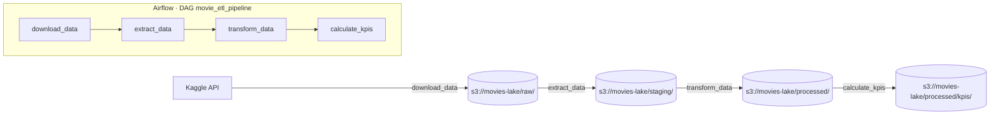

# 🎬 TMDB Movie ETL Pipeline

Pipeline de datos que descarga metadatos de películas de [Kaggle (TMDB 5000)](https://www.kaggle.com/datasets/tmdb/tmdb-movie-metadata), los limpia y enriquece, y calcula KPIs de negocio (rentabilidad por género, ranking de directores).

Orquestado con **Apache Airflow** sobre un **data lake compatible con S3** (SeaweedFS en local), todo en **Docker**. El diseño reproduce, a pequeña escala, un patrón habitual en AWS: `S3 (raw/staging/processed) + orquestador + procesamiento por lotes`.

## Arquitectura



| Zona | Contenido |
|---|---|
| `raw/` | CSVs originales de Kaggle, sin tocar |
| `staging/` | Datos ya tipados/filtrados por columnas (`extract.py`), listos para transformar |
| `processed/movies/` | Datos limpios y enriquecidos: género principal, director, año, rentabilidad |
| `processed/kpis/` | Rentabilidad media por género y ranking de directores |

Los datos viajan siempre por S3 entre tasks de Airflow (nunca en memoria compartida), y como los objetos S3 son inmutables, cada chunk se guarda como un archivo `part-0000.csv`, `part-0001.csv`... dentro de su prefijo.

## Estructura del proyecto

```
etl-pipeline-movies/
├── dags/
│   └── movie_etl_pipeline.py   # Orquestación: define las tasks y su orden
├── src/
│   ├── config.py                # Configuración centralizada (rutas, bucket, dataset)
│   ├── storage.py               # Funciones S3 (put_df, get_df, list_keys...)
│   ├── download.py              # Descarga desde Kaggle
│   ├── extract.py               # Lectura por chunks con tipos/columnas optimizados
│   ├── transform.py             # Limpieza, parseo de JSON, feature engineering
│   └── load.py                  # Guardado de resultados
├── tests/
│   ├── conftest.py
│   ├── test_transform.py
│   ├── test_extract.py
│   └── test_storage.py
├── config/, plugins/             # Carpetas estándar de Airflow (Docker)
├── Dockerfile
├── docker-compose.yaml           # Airflow + Postgres (metadata) + SeaweedFS (S3)
├── requirements.txt
├── requirements-dev.txt
├── pytest.ini
└── .env.example
```

`src/` contiene toda la lógica de negocio y no depende de Airflow: se puede testear e importar de forma aislada. `dags/` solo orquesta: decide qué se ejecuta, en qué orden, y qué pasa si algo falla.

## Cómo ejecutarlo

### 1. Requisitos
- Docker Desktop
- Una cuenta de Kaggle con token API (`kaggle.json`)

### 2. Configuración
```bash
cp .env.example .env
# Edita .env con tus credenciales (S3, Kaggle)
```

### 3. Levantar todo
```bash
docker compose up -d --build
```

Esto levanta:
- **Airflow** (webserver, scheduler) → http://localhost:8080
- **SeaweedFS** (almacenamiento S3) → consola en http://localhost:8888/buckets/
- **Postgres** (base de datos de metadata de Airflow)

### 4. Ejecutar el pipeline
Entra en http://localhost:8080, activa el DAG `movie_etl_pipeline` y lánzalo con ▶ ("Trigger DAG"). Las 4 tasks se ejecutan en orden: `download_data → extract_data → transform_data → calculate_kpis`.

Puedes seguir los datos generándose en tiempo real en el explorador de SeaweedFS (http://localhost:8888/buckets/movies-lake/).

## Tests

```bash
pip install -r requirements-dev.txt
pytest -v
```

Los tests cubren la lógica de transformación (parseo de JSON, feature engineering, KPIs) y la capa de almacenamiento S3, usando mocks para no depender de infraestructura real al ejecutarlos.

## Qué demuestra este proyecto

- ETL modular (extract/transform/load separados, testeables de forma independiente)
- Orquestación con Airflow (TaskFlow API), con reintentos y logging por task
- Patrón de data lake (raw → staging → processed) sobre almacenamiento S3-compatible
- Manejo correcto de la inmutabilidad de objetos en S3 (particionado por chunks)
- Entorno reproducible con Docker Compose
- Tests unitarios con `pytest` y mocking de servicios externos (`boto3`)

## Próximos pasos

- [ ] Cargar los KPIs finales en Postgres en lugar de CSV
- [ ] CI con GitHub Actions (lint + tests en cada push)
- [ ] Programar el DAG con `schedule` en vez de ejecución manual
